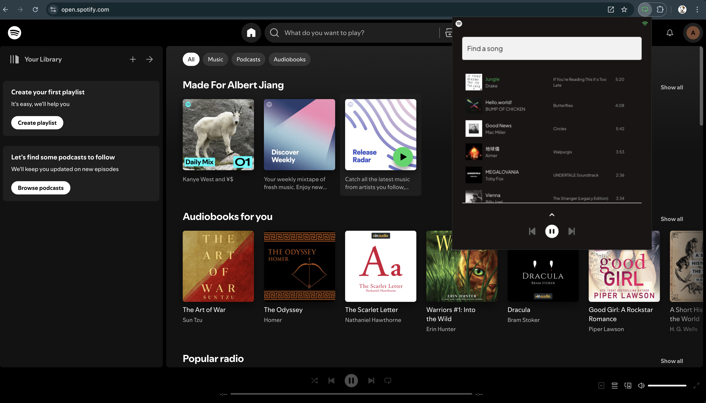

# Spotify Loop

A tool that lets you create a playlist that lives in Chrome.

## Why Should You Use This?

- **Organization**: Separate your dynamic playlist from your normal playlists.  
- **Clean UI**: A minimalistic yet functional design similar to Spotify’s mobile UI.  
- **Instant Access**: Control playback from your browser without switching tabs.  

## Future Features

- **Shuffle Button**: Will implement true shuffle functionality.  
- **Add Songs Directly**: Option to add songs directly using the Spotify web app.  
- **Export Playlist**: Export your playlist to Spotify or other formats.  

## Link to Chrome Web Store

[Spotify Loop - Chrome Extension](https://chromewebstore.google.com/detail/spotify-loop/mpimcbcjjjabekebnmdchehgkimeekfi)

## Usage

I am currently waiting for a quota extension from Spotify, so if you want to try the extension, feel free to reach out so I can manually add you to the user access list. Otherwise, you can clone this repo and try setting up an endpoint to generate the client ID and client secret in your config file. 